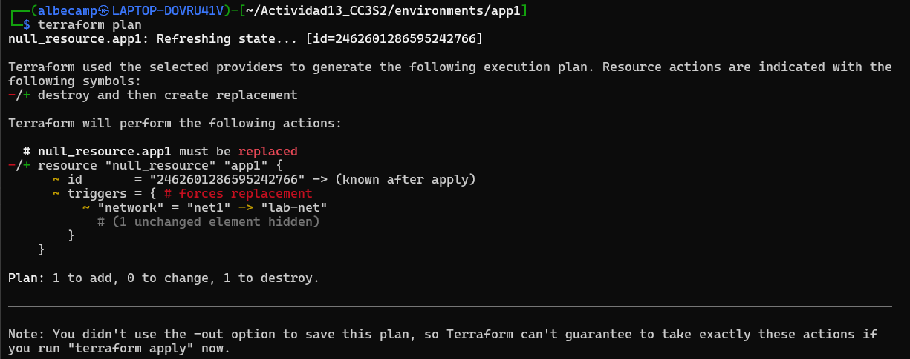
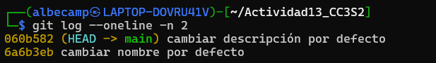
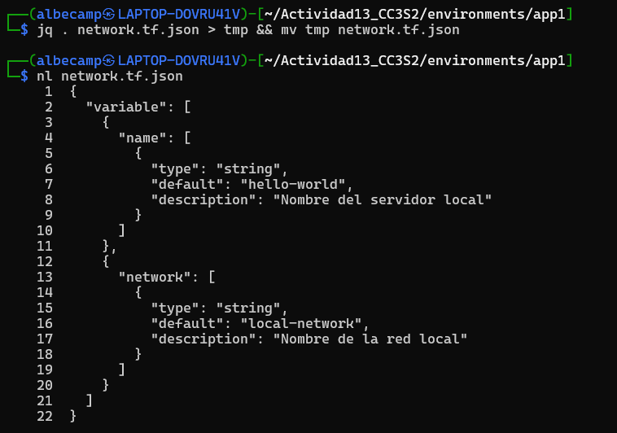
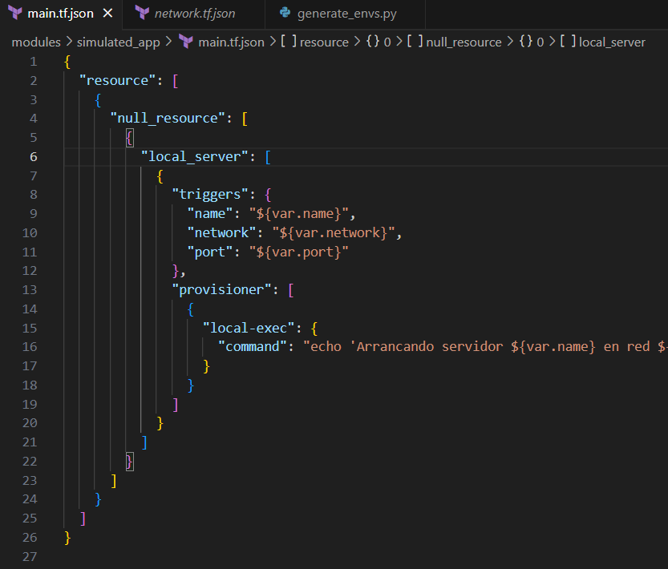
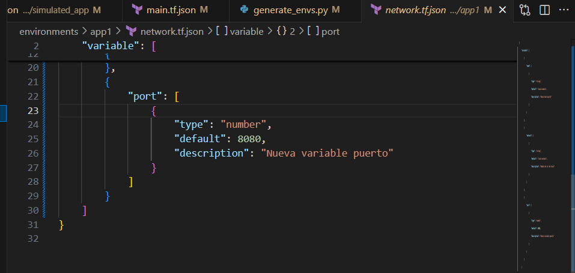

# Actividad13_CC3S2

### Propósito de la actividad

En esta actividad vemos cómo crear/generar infraestructura como código que sea fácil de comprender, además de la modificación de variables y cómo esto afecta a los entornos ya generados.

### Estructura

```
.
├── environments
│   ├── app1
│   │   ├── main.tf.json
│   │   └── network.tf.json
│   ├── app2
│   │   ├── main.tf.json
│   │   └── network.tf.json
│   └── app3
│       ├── main.tf.json
│       └── network.tf.json
├── generate_envs.py
├── img
│   ├── fase1_1.png
│   ├── fase2_1.png
│   ├── fase3_1.png
│   ├── fase3_2.png
│   ├── fase3_3.png
│   └── fase3_4.png
├── modules
│   └── simulated_app
│       ├── main.tf.json
│       └── network.tf.json
├── README.md
└── tools
```

## Fase 1

Se crean los entornos `app1`, `app2` y `app3` con el script `generate_envs.py`.

Luego, nos dirigimos a `environments/app1`, donde ejecutamos:

```bash
$ terraform init
$ terraform plan
$ terraform apply
```

Por último, realizamos la modificación que nos indica dentro de `main.tf.json` del entorno `app1`, actualizando el valor de `netword` a `lab-net`. Luego, ejecutamos nuevamente `terraform plan` y vemos que Terraform detecta el trigger, el cambio realizado.



### Preguntas

**1.** ¿Cómo interpreta Terraform el cambio de variable?  
Terraform recibe la nueva variable cuando realizamos `terraform plan`, entonces, Terraform compara con el estado actual y muestra qué valores cambiarán. Nada va a cambiar hasta que se ejecute `terraform apply`, si es necesario recrear entonces el terraform plan nos lo mostrará.

**2.** ¿Qué diferencia hay entre modificar el JSON vs. parchear directamente el recurso?  
Editar el archivo `main.tf.json` cambia la configuración ya tomada en cuenta por Terraform. Parchear directamente puede modificar el estado hasta corromperlo. Entonces es mejor editar la configuración y usar terraform play y apply.

**3.** ¿Por qué Terraform no recrea todo el recurso, sino que aplica el cambio "in-place"?  
Porque nos permite actualizar ese campo. Terraform genera el plan y aplica una actualización in‑place, solamente llega a recrear todo si el atributo requiere un forcenew.

**4.** ¿Qué pasa si editas directamente main.tf.json en lugar de la plantilla de variables?  
Editar el archivo `main.tf.json` aplica el cambio luego de `terraform plan` y `terraform apply`,actualizando el estado. Por otro lado, si `generate_envs.py` regenera el archivo, los cambios pueden perderse.

## Fase 2

### A. Remediación de 'drift' (out-of-band changes)

Primero nos dirigimos a `environments/app2` y luego ejecutamos:

```bash
$ terraform init
$ terraform plan
$ terraform apply
```

Esto creará el recurso con las valores normales: `"name"    = "app2"` y `"network" = "net2"`.

Realizando los pasos que indican en la actividad, no se logra conseguir lo que debería mostrar: *Verás un plan que propone revertir ese cambio.*

Por lo tanto, lo que me funcionó fue modificar el archivo `terraform.tfstate`, modificando el nombre a `hacked-app`.

Hecho dicho cambio, volvemos a ejecutar `terraform plan` y se obtiene que el recurso `hacked-app` será destruido y se creará el recurso original (`app2`).


## Fase 3

### Control de versiones comunica contexto

Se modificó el valor `default` de la variable `name` en el archivo `modules/simulated_app/network.tf.json` de `"hello-world"` a `"nuevo-nombre"`.

Luego se cambió la variable `description` a `"Nueva descripción"`.

Por último, se realizaron los commits que piden, uno por cada modificación.



### Linting y formateo

Primero se instala la herramienta `jq` para el formateo de archivos JSON.

Ejecutamos el comando: `jq . network.tf.json > tmp && mv tmp network.tf.json` en `app1`.

Con el comando conseguimos un nuevo archivo en el cual la única diferencia es que la tabulación cambió (de 4 espacios a 2 espacios).



### Nomenclatura de recursos

Se renombra el recurso en `modules/simulated_app/main.tf.json` de `"hello-server"` a `"local_server"`, según lo que se pide.

Luego, se modifica `generate_envs.py` para usar el nuevo nombre: `"local_server"`, y no nombres dinámicos.

Por último, volvemos a generar los entornos con el script.



### Variables y constantes

Añadimos una nueva variable: `port` en `modules/simulated_app/network.tf.json`, de tipo `number` y como valor default `8080`.

Luego, modificamos el archivo `main.tf.json`, donde añadimos el puerto.

Por último, se modifica `generate_envs.py` para la asignación de puertos de manera que aumente de uno en uno (8081, 8082, 8083). Se vuelven a generar los entornos.



## Fase 4

**1.** ¿Cómo extenderías este patrón para 50 módulos y 100 entornos?  
Podría crearse un archivo de configuración aparte donde ahí se definan todos los entornos con sus respectivos parámetros. También, se podría usar scripts en Python (como en esta actividad) para generar los entornos automáticamente con bucles.

**2.** ¿Qué prácticas de revisión de código aplicarías a los .tf.json?  
Primero usar la herramienta `jq` para verificar que el JSON sea válido y esté bien formateado (por ejemplo, tabulaciones de 2 espacios). Luego, ejecutar `terraform validate` para cada entorno creado, para detectar errores de sintaxis.

**3.** ¿Cómo gestionarías secretos en producción (sin Vault)?  
Se podría marcar las variables con `sensitive: true` en el JSON de terraform. También, crear un archivo `.env.example` y añadir el archivo `.env` al `.gitignore`, acompañado de documentación clara donde se explique que variables de entorno son necesarias para cada entorno.

**4.** ¿Qué workflows de revisión aplicarías a los JSON generados?  
Validar cada entorno generado con `terraform plan` para verificar que no haya errores.