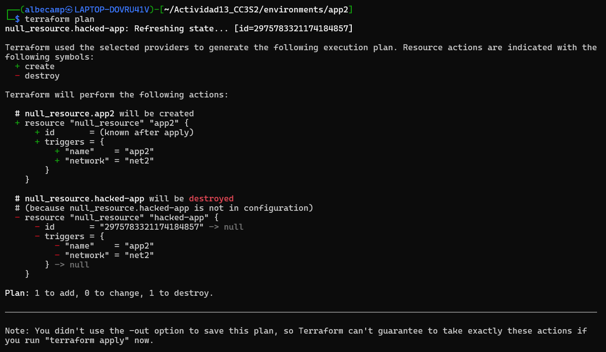

# Actividad13_CC3S2

## Fase 1

Se crean los entornos `app1`, `app2` y `app3` con el script `generate_envs.py`.

Luego, nos dirigimos a `environments/app1`, donde ejecutamos:

```bash
$ terraform init
$ terraform plan
$ terraform apply
```

Por último, realizamos la modificación que nos indica dentro de `main.tf.json` del entorno `app1`, actualizando el valor de `netword` a `lab-net`. Luego, ejecutamos nuevamente `terraform plan` y vemos que Terraform detecta el trigger, el cambio realizado.


### Preguntas

**1.** ¿Cómo interpreta Terraform el cambio de variable?  
Terraform recibe la nueva variable cuando realizamos `terraform plan`, entonces, Terraform compara con el estado actual y muestra qué valores cambiarán. Nada va a cambiar hasta que se ejecute `terraform apply`, si es necesario recrear entonces el terraform plan nos lo mostrará.

**2.** ¿Qué diferencia hay entre modificar el JSON vs. parchear directamente el recurso?  
Editar el archivo `main.tf.json` cambia la configuración ya tomada en cuenta por Terraform. Parchear directamente puede modificar el estado hasta corromperlo. Entonces es mejor editar la configuración y usar terraform play y apply.

**3.** ¿Por qué Terraform no recrea todo el recurso, sino que aplica el cambio "in-place"?  
Porque nos permite actualizar ese campo. Terraform genera el plan y aplica una actualización in‑place, solamente llega a recrear todo si el atributo requiere un forcenew.

**4.** ¿Qué pasa si editas directamente main.tf.json en lugar de la plantilla de variables?  
Editar el archivo `main.tf.json` aplica el cambio luego de `terraform plan` y `terraform apply`,actualizando el estado. Por otro lado, si `generate_envs.py` regenera el archivo, los cambios pueden perderse.

## Fase 2

### A. Remediación de 'drift' (out-of-band changes)

Primero nos dirigimos a `environments/app2` y luego ejecutamos:

```bash
$ terraform init
$ terraform plan
$ terraform apply
```

Esto creará el recurso con las valores normales: `"name"    = "app2"` y `"network" = "net2"`.

Realizando los pasos que indican en la actividad, no se logra conseguir lo que debería mostrar: *Verás un plan que propone revertir ese cambio.*

Por lo tanto, lo que me funcionó fue modificar el archivo `terraform.tfstate`, modificando el nombre a `hacked-app`.

Hecho dicho cambio, volvemos a ejecutar `terraform plan` y se obtiene que el recurso `hacked-app` será destruido y se creará el recurso original (`app2`).



## Fase 3

